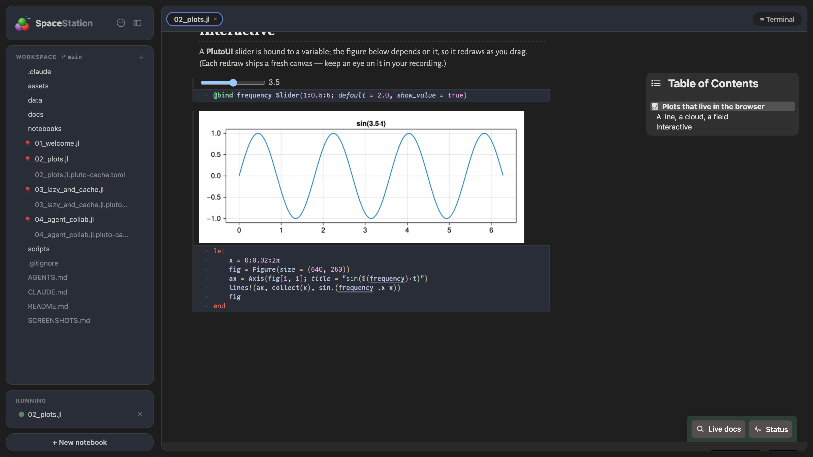
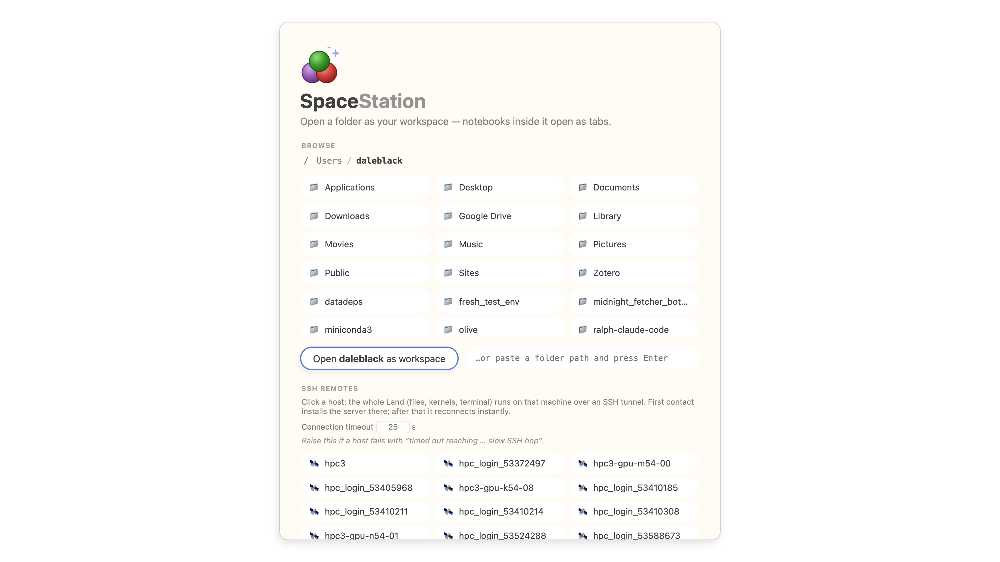
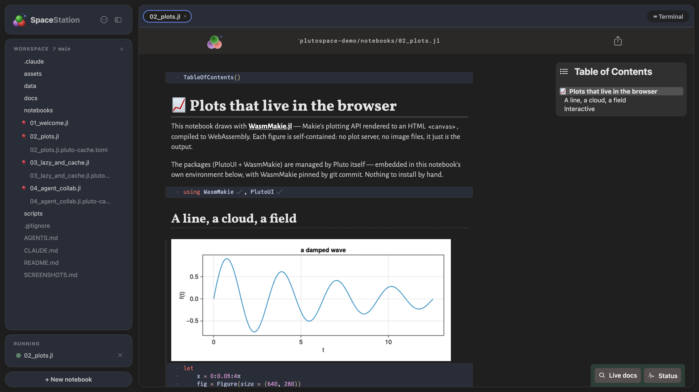
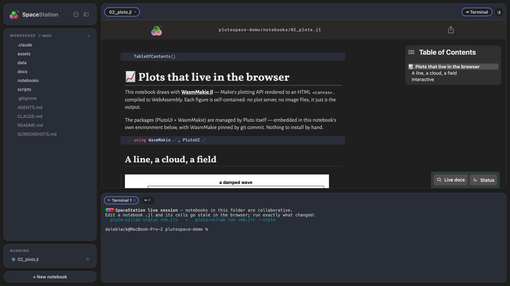
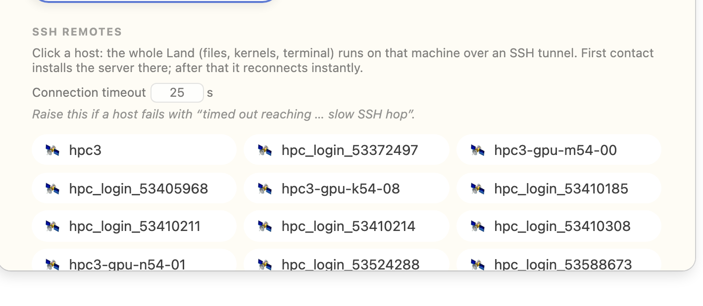
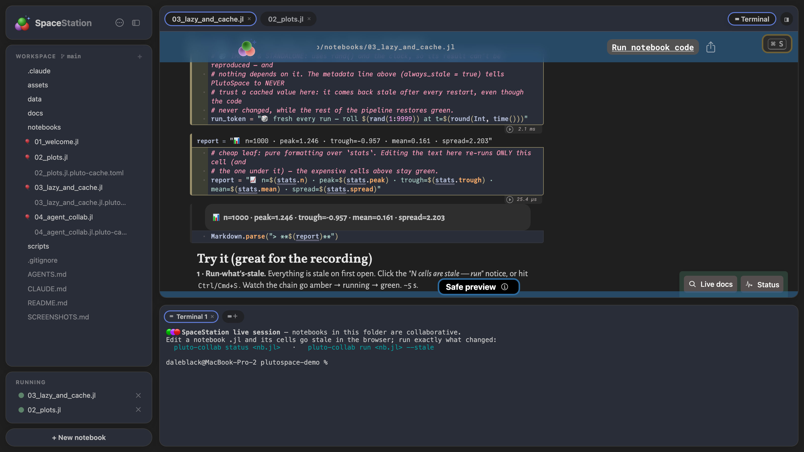
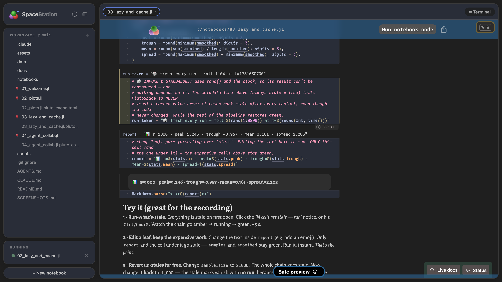
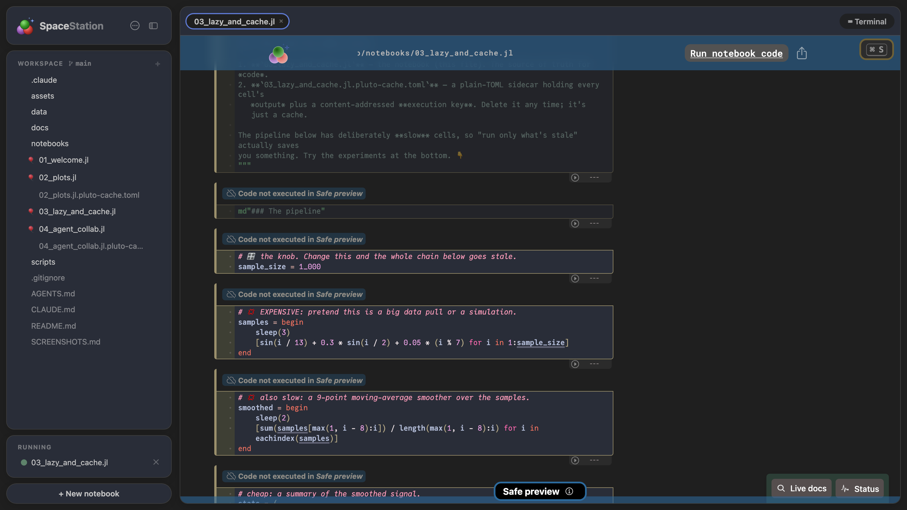

<div align="center">

<h1 align="center">

&nbsp;SpaceStation.jl
</h1>

### A workspace for Pluto notebooks — for humans and agents.

[Pluto.jl](https://github.com/fonsp/Pluto.jl) gives you a reactive notebook.
**SpaceStation gives you the *space* around it:** a folder workspace, tabbed notebooks and files,
a real terminal, point-and-click SSH remotes, outputs that survive restarts, and first-class
**human + agent collaboration** on one live session — all on the unmodified Pluto editor.

<br>



</div>

## Install & run

SpaceStation installs as a **Julia [Pkg App](https://pkgdocs.julialang.org/dev/apps/)** — one command
puts a real `spacestation` executable on your `PATH`, so it launches like any CLI tool (no
`julia -e …`, no manual `import`):

```julia
julia> import Pkg; Pkg.Apps.add(url="https://github.com/GroupTherapyOrg/SpaceStation.jl")
```

```sh
$ spacestation               # workspace picker
$ spacestation ~/project     # open a folder as a workspace
$ spacestation notebook.jl   # open a single notebook
$ spacestation --help
```

Prefer it as a library? `import SpaceStation; SpaceStation.run()` works too (every `Pluto.run` keyword
applies). Lazy/collab mode is the default; add `--autorun` for classic Pluto reactivity.

> Want to try everything below hands-on? There's a ready-made demo workspace with a guided
> shot list: **[spacestation-demo](https://github.com/GroupTherapyOrg/spacestation-demo)**.

### Or grab the desktop app

SpaceStation is also a native desktop app — workspace tabs in the title bar, a Julia version
picker on launch (every juliaup channel, one-click installs, updates), and **no Julia required**:
a machine with nothing installed gets Julia set up by the app itself (juliaup is bundled).
Download from the [latest release](https://github.com/GroupTherapyOrg/SpaceStation.jl/releases/latest):

| Platform              | File                               |
| --------------------- | ---------------------------------- |
| macOS (Apple Silicon) | `SpaceStation-mac-arm64.dmg`       |
| macOS (Intel)         | `SpaceStation-mac-x64.dmg`         |
| Windows               | `SpaceStation-win-x64.msi`         |
| Linux                 | `SpaceStation-linux-x64.AppImage`  |

The builds aren't code-signed yet, so the **first** launch needs one extra step:

- **macOS** — drag the app to Applications, then in Terminal:
  `xattr -dr com.apple.quarantine "/Applications/SpaceStation.app"`
  (or right-click → Open, then **System Settings → Privacy & Security → Open Anyway**).
- **Windows** — at the SmartScreen prompt choose **More info → Run anyway**.
- **Linux** — `chmod +x SpaceStation-linux-x64.AppImage`, then run it.

Installing the desktop app also registers the `spacestation` CLI above for free. The reverse is
deliberately one-way: `Pkg.Apps.add` installs only the CLI, never the desktop app.

---

# What SpaceStation adds to Pluto

Everything in this section is something **vanilla Pluto doesn't have.** The notebook engine,
editor, reactivity, `@bind`, packages, and the `.jl` file format are all Pluto's — and notebooks
stay **byte-for-byte compatible in both directions.** SpaceStation only adds the space around them.

| | |
|---|---|
| 📁 [Open a folder as a workspace](#-open-a-folder-as-a-workspace) | 🪟 [Notebooks & files are tabs](#-notebooks-and-files-are-tabs) |
| 💻 [A real, persistent terminal](#-a-real-persistent-terminal) | 🌐 [SSH remote workspaces](#-ssh-remote-workspaces) |
| 🤝 [Lazy mode — humans + agents, one session](#-lazy-mode-humans-and-agents-on-one-live-session) | 💾 [Two files; outputs survive restarts](#-two-files-and-outputs-that-survive-restarts) |

---

## 📁 Open a folder as a workspace

SpaceStation starts where an IDE does: a **VS Code-style "Open Folder"** hub with recent
workspaces, a filesystem browser, and (if you have SSH hosts) one-click remotes. Pick a folder
and its file tree becomes your sidebar — notebooks and files open as tabs beside it.

<div align="center">

</div>

---

## 🪟 Notebooks and files are tabs

Notebooks open as tabs — each one the **unmodified Pluto editor** in its own session. Plain
files open in tabs too, edited with the same CodeMirror — including the per-notebook
`*.pluto-cache.toml` sidecar, which is just readable TOML. Add and delete files right from the tree.

<div align="center">

</div>

---

## 💻 A real, persistent terminal

An integrated **PTY shell** runs in the workspace folder. Dock it bottom, right, or as an editor
tab; and — unlike a browser terminal — it's a **persistent session**: refresh the page and the
shell keeps running, replaying its scrollback on reconnect (tmux semantics, no tmux). It also
exports `SPACESTATION_PORT`/`SPACESTATION_SECRET` and puts `pluto-collab` on `PATH`, so a coding agent
launched here just works.

<div align="center">

</div>

---

## 🌐 SSH remote workspaces

Click a host from your `~/.ssh/config` and the **entire workspace** — files, kernels, terminal, the
agent API — runs on that machine over an SSH tunnel. First contact installs SpaceStation on the
remote; after that it reconnects instantly. The VS Code Remote-SSH model, with zero config beyond
your SSH setup.

<div align="center">

</div>

---

## 🤝 Lazy mode: humans and agents on one live session

SpaceStation's default isn't autorun. Editing a cell — **in the browser *or* on disk** — marks that
cell **stale** instead of running it. When explicitly run, its dependents follow through normal
Pluto reactivity. Because of that, a human in the browser and a coding agent in a terminal can work on the
**same live notebook** at once — same kernel, same state. The agent edits the `.jl` with its normal
file tools; the affected cells turn **amber within a second** in the browser, and a run applies them.
No MCP, no plugins — just a small CLI, [`pluto-collab`](bin/pluto-collab).

<div align="center">

</div>

The agent surface is deliberately **two-tiered** — editing and executing are separate steps:

1. **Edit → _stage._** The agent edits the `.jl` with its normal file tools. That only marks the
   changed cells **stale** — *nothing runs*. The human watches them turn
   amber within a second.
2. **Run → _apply._** An explicit `run --stale` executes only the stale closure. Separating stage
   from apply is deliberate: you review what's about to run, expensive cells don't fire on every
   keystroke, and the session stays reproducible.

The mechanism is plain — no MCP, no plugins:

- a **connection file** at `~/.local/state/pluto/servers/<node>-<port>.json` (port + secret — the Jupyter idiom),
- a plain **HTTP API** at `/api/v1/…` (curl-able, authed with `?secret=…`),
- a tiny **CLI**, in two equivalent front-ends:

```sh
pluto-collab        status nb.jl     # Unix shorthand — a bash script (curl + sed)
spacestation collab status nb.jl     # any platform incl. Windows PowerShell — built into the app, no deps

# the flow (either front-end — same commands, arguments, and exit codes):
… status nb.jl               # REVIEW: per-cell STALE / COLD / ERRORED / output (reflects the file right now)
… run    nb.jl --stale       # APPLY:  run exactly what's outdated (blocks; exit 1 on error)
… output nb.jl --cell <id>   # read a cell's full, untruncated output
… figure nb.jl --cell <id>   # save a cell's rendered plot to an image file
```

`pluto-collab` needs bash + curl (Unix); **`spacestation collab …` is the identical command set built
into the app** with no external dependencies, so the surface works the same in a Windows terminal.
Inside a SpaceStation terminal, `SPACESTATION_PORT` / `SPACESTATION_SECRET` point either one at the live
session automatically.

Two guarantees make the loop reliable:

- **`status` always reflects the file.** It re-syncs from disk on every call, so *immediately* after
  an edit it reports the true stale set — the review step never lags the ~½-second file watcher.
- **Runs share the browser's execution queue.** HTTP runs go through the same path as browser clicks,
  so both sides see cells turn amber → running → green live. Staleness is verified against
  content-addressed **execution keys**, so reverting an edit un-stales a cell with no run at all.

See **[COLLAB.md](COLLAB.md)** for the full details and an `AGENTS.md` stanza you can drop into any repo.

---

## 💾 Two files, and outputs that survive restarts

Every notebook is **two files**: the `.jl` (your code — the source of truth, unchanged from vanilla
Pluto) and a plain-TOML **`<notebook>.jl.pluto-cache.toml`** sidecar holding every cell's output plus
its execution key. Reopen a notebook and **every output is restored instantly** from that sidecar —
no recompute. Vanilla Pluto has no output persistence; it either re-runs everything on open or shows
nothing.

<table>
<tr>
<td width="50%"></td>
<td width="50%"></td>
</tr>
<tr>
<td align="center"><em><strong>With</strong> the sidecars → outputs restored on open</em></td>
<td align="center"><em><strong>Without</strong> them → "Code not executed" (plain Pluto)</em></td>
</tr>
</table>

<div align="center"><em>Same notebook, same fresh restart — the sidecar is the only difference. Restored cells are trusted <strong>only when their execution keys match</strong> the current code and upstream results; impure cells (<code>rand()</code>, the clock, I/O) opt out with <code>always_stale = true</code>.</em></div>

---

## Relationship to Pluto.jl

SpaceStation is a friendly fork of [Pluto.jl](https://github.com/fonsp/Pluto.jl). The notebook engine,
editor, file format, and reactivity are Pluto's, and notebooks remain fully compatible in both
directions. For everything about notebooks themselves (reactivity, `@bind`, packages, exporting),
see the [Pluto documentation](https://plutojl.org/). 🎈

SpaceStation adds the *space around* the notebooks: workspaces, tabs, terminal, remotes, persistence,
and first-class human + agent collaboration. `--autorun` gives you classic Pluto reactivity
whenever you want it, byte-for-byte.

**SpaceStation is developed and owned by Dale Black / [GroupTherapyOrg](https://github.com/GroupTherapyOrg).
It is an independent fork and is NOT developed, maintained, or endorsed by the Pluto.jl team** — please
direct SpaceStation questions, issues, and feedback to this repository, not to the Pluto developers.

## Status

⚠️ **Early and experimental.** SpaceStation is under active development by a small team; expect rough
edges and breaking changes. Issues and ideas are welcome on this repo.

## AI disclosure

Much of SpaceStation's code is written with AI assistance (Claude). Commits are co-authored accordingly.

## License

MIT — see [LICENSE](LICENSE). SpaceStation is developed and owned by Dale Black / GroupTherapyOrg.
It builds on **Pluto.jl** (© the Pluto.jl authors — Fons van der Plas and contributors, MIT), which
retains its own copyright; the original Pluto license is preserved in [LICENSE](LICENSE).
